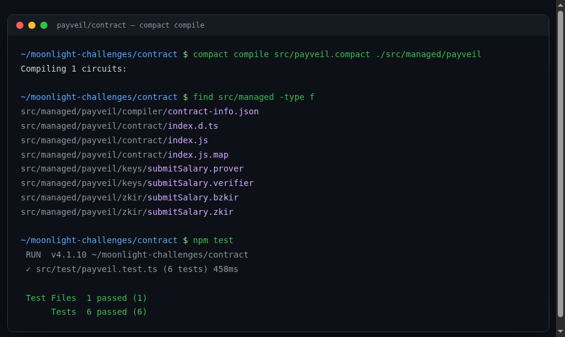
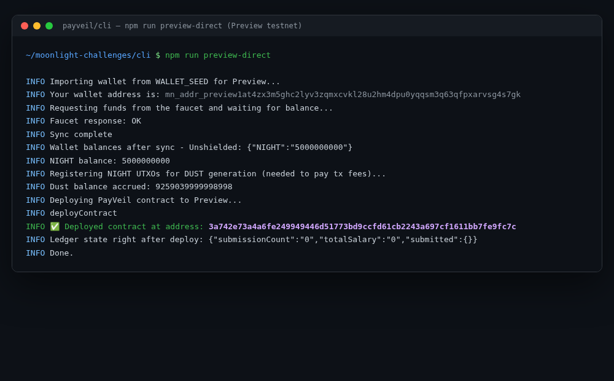

# PayVeil

**PayVeil** is a privacy-first salary benchmarking tool built on [Midnight](https://midnight.network) with the [Compact](https://docs.midnight.network) smart contract language.

People almost never share their real salary — not with coworkers, not with public tools — because doing so is a one-way disclosure with no way to take it back. PayVeil lets anyone contribute their salary to a shared benchmark pool using a zero-knowledge circuit: the raw number is used as a **private witness** inside the proof, and only the *updated aggregate total* is ever written to the public ledger via an explicit `disclose()` call. No individual salary — and no submitter identity — ever appears on-chain. Over future cycles, this grows into per-role and per-company cohorts, verified-employer eligibility proofs, pay-gap analysis, and time-series compensation trends, all without any participant's individual figure ever being exposed.

This repository is the **Level 1 (New Moon)** submission for the Midnight Moonshots challenge: toolchain setup, a first Compact contract with public ledger state and a private witness, and a deployment to Midnight's Preview/Preprod testnet.

## How it works

- Anyone can call `submitSalary`, passing their salary as a private witness.
- A nullifier — a hash of a locally-generated secret ID — is checked against a public `submitted` set to stop the same identity from submitting twice, without ever revealing who they are.
- The circuit adds the private salary to the public running total and discloses only that new total. The individual number that produced it is never written anywhere.

### Public ledger state vs. private witness

| | Public ledger state | Private witness |
|---|---|---|
| **What it is** | Data written to the chain, readable by anyone | Data supplied locally by the caller, used only inside the zero-knowledge proof |
| **In this contract** | `submissionCount` (how many people have submitted), `totalSalary` (running sum), `submitted` (a set of nullifiers, used only to block double-submission) | `mySalary` (the actual salary figure), `mySecretId` (a local secret identifying "this wallet" to the contract) |
| **How it leaves the private domain** | N/A — it's already public | Only via an explicit `disclose()` call. In `submitSalary`, the *only* things disclosed are the nullifier (an opaque hash, not the secret ID itself) and the new running total (a sum, not the individual salary) |
| **Who can see it** | Everyone, forever | Only the person who ran the proof, on their own machine |

This is the core discipline `disclose()` is meant to enforce: nothing leaves the private/proof context unless a developer deliberately says so, one value at a time.

## Project structure

```
contract/    Compact contract, compiled circuits (managed/), and the offline test suite
api/         TypeScript API that wraps the deployed contract (deploy/join/submitSalary)
cli/         Interactive CLI used to deploy to Preview/Preprod and exercise the contract
```

## Setup instructions (run locally)

### Prerequisites

- [Node.js 22+](https://nodejs.org)
- [Docker](https://www.docker.com/) (for the local proof server)
- The Compact compiler:
  ```bash
  curl --proto '=https' --tlsv1.2 -LsSf https://github.com/midnightntwrk/compact/releases/latest/download/compact-installer.sh | sh
  compact update
  compact --version
  ```

### Install and compile

```bash
git clone <this-repo-url>
cd moonlight-challenges
npm install

# Compile the contract -> generates contract/src/managed/payveil (circuits + keys)
cd contract && npm run compact
```

### Run the test suite

```bash
cd contract
npm test
```

The tests run entirely offline against a local circuit simulator (`contract/src/test/payveil-simulator.ts`) — no proof server or network connection required.

### Deploy to Preview

```bash
# Start the local proof server (used to generate proofs before submitting to the network)
docker run -p 6300:6300 midnightntwrk/proof-server:8.0.3 midnight-proof-server -v

# In another terminal, from the repo root:
cd cli
npm run preview-direct
```

`preview-direct` builds a wallet (fresh, or imported via `WALLET_SEED`/`WALLET_MNEMONIC` env vars), waits for it to be funded, registers the NIGHT for DUST generation (Midnight's fee token), and deploys PayVeil, printing the resulting contract address.

Funding a wallet requires solving a captcha, so it has to happen through the faucet's web UI at the URL the script logs for your wallet's address — https://midnight-tmnight-preview.nethermind.dev/ — rather than automatically; the SDK's built-in automated faucet client currently posts to the wrong endpoint and never actually delivers funds, which is worth knowing if you hit the same dead end.

There's also `npm run preview-remote` (and `preprod-remote`), which drive an interactive menu via `@midnight-ntwrk/testkit-js`'s `RemoteTestEnvironment` and can deploy or join a contract. It worked but was substantially less reliable in practice (its own ephemeral proof-server containers churned, and a couple of its wallet-sync checks waited on lanes — shielded/dust "strict" sync — that never resolved for a fresh wallet) — `preview-direct` exists because of that.

## Deployed contract

- **Network:** Preview
- **Contract address:** `3a742e73a4a6fe249949446d51773bd9ccfd61cb2243a697cf1611bb7fe9fc7c`

## Screenshots

**Successful compile (circuits listed):**



**Deployed contract with address:**



## Roadmap

Level 1 ships the minimal loop: submit a private salary, disclose only the aggregate. Planned for later cycles:

- Per-role and per-company cohorts (so "average salary" means something)
- Verified-employer-domain eligibility proofs, so submissions are trustworthy without being identifying
- Pay-gap and time-series analysis over the disclosed aggregates
- A small web frontend for submitting and browsing benchmarks

## License

MIT. Portions of the deployment/CLI scaffolding are adapted from Midnight's [example-bboard](https://github.com/midnightntwrk/example-bboard) (Apache-2.0).
